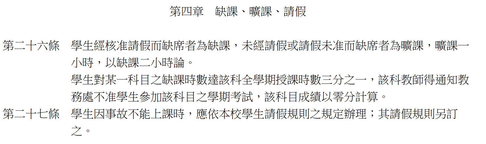

# 資訊與人工智慧概論 課程介紹

|課號|授課老師|
|---|---|
|114-1 (IE123)|呂卓勲、孫天龍|

## 授課教師聯絡資訊

| 老師 | Email | Office Hour |
|---|---|---|
| 呂卓勲 | xxx@xxx | 週X xx:xx-xx:xx |
| 孫天龍 | xxx@xxx | 另行公告 |

## 課程概要

> 理解計算機基礎架構與科技演進現況，能讓你對於電腦與資訊科技有基本概念

無論你要做AI應用還是僅是要應用各種資訊科技，了解計算機基礎架構、當代資訊技術、資訊系統、網路技術 … 絕對有幫助。

- 呂卓勲老師：負責資訊科技概論

> 對當代最重要的資訊科技：人工智慧（Artificial Intelligence, AI），對其基本知識與應用有所概念

不管你高興不高興，喜歡不喜歡，AI 已經滲入你的生活與學習，各種 AI 應用也已經成為各行各業的重要議題，本課程幫助同學能對於 AI 有基本概念。

- 孫天龍老師：負責人工智慧概論

> 注意：**本學期很悲慘**，10/10、10/24要放假，卓勳老師必須要在六周內搞定資訊科技的部分。

上課會很快、很緊湊、拜託請認真上課、不要隨便翹課。

## 學期配分比重

|授課老師|比重|如何評分|說明|
|---|---|---|---|
|呂卓勲|50%|期中考|假如你期中考考80分，總成績就拿到 $$80 \times 50\% = 40分$$|
|孫天龍|50%|共五次報告|計算方式請記得與孫老師做最後確認|

> 考完期中考後週一公布

## 課程教材

|授課老師|哪裡找得到？|說明|
|---|---|---|
|呂卓勲|[連結](https://github.com/billy1125/Introduction-of-Information-Technology)|這是呂老師自編的教材，你可以自行再利用，例如用 AI 幫你做筆記、不懂的都可以拿去問 AI|
|孫天龍|Portal|孫老師應該還會再提供別的教材|

## 課程進度表

| 週次 | 日期 | 授課老師 | 主題 |
|---|---|---|---|
| 1 | 09/xx | 呂卓勲 | 計算機歷史與架構 |
| ... | | | |
| 9 | xx/xx | — | **期中考** |

## 期中考試

### 考試時間地點

- 期中考將在「第 9 周」進行，沒事不會改期，請把你的時間排開
- 考試地點一定是這間教室

### 考試範圍

- 考試題目「可能」包括選擇題、簡答題等
- 考試範圍僅含呂卓勲老師的教材內容

### 基本規定

- 學生須按時到達試場，遲到逾 20 分鐘者，不得入場。已進入試場者，30 分鐘內不得出場
  - 如果你發現到了教室門外，門是鎖上的，你已經遲到超過 20 分鐘，視同缺考
- 請務必準時出席參與考試，若因個人因素無法參與考試，請依照學校規定請假，並且申請補考事宜
  - 期中考試請假必須要是一個合理的理由，什麼是合理的理由？請看請假規定章節
  - 若請假通過，你可以參加補考，補考時間另訂，分數將以 80% 計算，請同學沒事不要缺考
- 請自行準備文具，老師不會幫你準備
- 考試時間不得以任何理由暫離教室，請先在預習時間上廁所
- 成績預計在考試後的第一個禮拜一公布，公布後 **在週三前** 可提出複查，逾期恕不受理

### 期中考評分

期中考分數原始分數最低 0 分，最高 100 分，但是依照等第會有以下等級：

|期中考分數（原始）|期中評量等第|備註|
|---|---|---|
|80分以上|A|優異|
|70分以上未滿80分|B|良好|
|60分以上未滿70分|C|待加強（依實際狀況而定）|
|未滿60分|D|導師會關切，你爸媽可能會知道|

學期中之後各位同學你除了分數，也會看到等第，如果你拿到了一個 D，那學校會通知你，導師也會關切你，爸媽可能會知道。

> 請同學加油！

### 期中考複習課程（畫重點？！）

因為本學期前段太多放假，預計將期中考周的周三晚間（詳細時間地點會再公告），會開設考前複習或整理課程，歡迎同學多參加。

有任何本課程問題的同學都可以來，也歡迎同學可以另外找時間跟老師討論，當然同學間討論更好！

## 課堂規範

### 簽到與簽退

我們每一週上課都要簽退與簽到，助教將會在上課前 30 分鐘前給同學簽到，下課時間後則可以簽退。

||時間|說明|
|---|---|---|
|簽到|上課前 10-20 分鐘到上課鐘響後 20 分鐘內|超過時間後助教就會離開|
|簽退|第三堂課下課後|助教會在現場等候，沒有同學要簽退就會離開|

如何計算曠課時數，請見下表：

|狀況|備註|
|---|---|
|未簽到有簽退|曠課1小時|
|有簽到未簽退|曠課1小時|
|未簽到也未簽退|曠課3小時|

> 請注意：簽到與簽退時間到，助教就會立刻離開教室，請同學不可因為個人因素干擾助教進行前述的工作！違者將依照學校規定處理

### 扣考規則

**所謂扣考就是：不能參加期中考。** 學校已經將相關規定寫在學則裡面：

簡單來說，如果一堂課 3 學分，全學期共有 54 小時。學校規定是缺課 18 小時就會被扣考，所謂「缺課」包括了「曠課（曠課 1 小時，以缺課 2 小時論）、病假、事假」都算在內。

換句話說，假如你的曠課、病假、事假時數通通加起來超過 18 小時，就等於被當。但是你放心，卓勲老師這裡的規定很寬鬆，如下：

> **我只看曠課，曠課 1 小時，以缺課 2 小時論，曠課超過 18 小時（等於有六次沒來上課），將逕行扣考。**

換句話說，你只要想辦法不要超過曠課 18 小時，就不會被扣考。

（你自己算算看，要曠課超過 18 小時，其實很難！所以拜託，不要太誇張。）

因此，如果沒有來上課，請務必請假。關於請假規定，請繼續往下讀。

### 請假規定

- 請假請自行按照學校規定申請，但是請勿濫用各種假別…務必仔細思考有必要才請假
- 你的請假理由，麻煩不要太扯，什麼叫做很扯的理由，像是：
  - 要去打工、打工班表已排好 🈲 🙅
  - 你考駕照考了四五次甚至更多 🚗 🛵
  - 要去排演唱會周邊、心儀的偶像閃電結婚/退伍 👩‍🎤 🧑‍🎤
  - 我的鬧鐘壞了 ⏰️
  - 昨晚熬夜打電動，現在太睏了 🎮
  - 男生請生理假？
  - 我頭髮骨折
  - 任何太蝦 🦐 的理由...
- 真的因為某些因素會有長期缺課，請務必聯絡任課老師，不要預設任何情況，敬請先跟任課老師討論，以免造成不可挽回的悲劇狀況

### 其他規範

- 上課禁止使用智慧型手機，使用電腦請務必與本課程有關，要追劇、打電動、看直播、聽音樂請回家
- 如果我發現你玩得太過頭，老師不會罵人但是請你離開教室，想好好上課再回來

## 成績有問題怎麼辦？

首先，請先跟任課老師聯絡，不要預設任何立場。

成績有問題不一定是「針對你/黑箱/完全不能改」，可能只是誤植、算錯，請在還可以改的期限內提出問題，確認成績是否正確，不用客氣。

成績不及格，不要認為老師一定會當掉你，請好好說明你的狀況，和老師討論是否有補救方案？

但請不要認為老師要給你補救是天經地義，假如你的期中成績不是58、59分，而是可憐的低於50分，這太難救了，請下學期/學年再來吧。

> 被當掉不是天崩地裂，人生還很長，真的有困難早點讓老師知道，總比成績都送出去了才來求情好得多。

## LINE 群組

本課程所有公告事務於LINE上公告，請加入LINE群組。

> 請同學務必加入，免得漏掉重要訊息，每學年都有人最後才加入，然後發現自己什麼都不知道，請不要當這種人

為避免干擾同學，若有需要公告的事務，老師將僅於上班時間周一至五 09:00-16:00 公布，除非有緊急事務，則儘可能於晚間9時前公布。

同學有疑問，或只是想聊天，不在此限（也請注意同學之間應有的禮節）。

### A 班

### B 班

