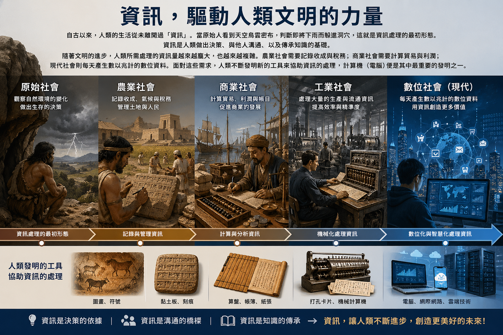
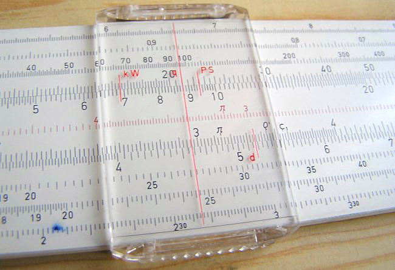

# 計算機歷史與資訊科技概論

以下為元智大學工業工程與管理學生修習課程「資訊與人工智慧概論」之用，修課學生可以自由使用，可使用GitPrint.com或其他類似等工具將Markdown文件轉為PDF，或使用生成式AI工具作為延伸學習或整理文件。

---

## 一、導論：資訊與人類文明

### 人類生活與資訊需求

自古以來，人類的生活從未離開過「資訊」。當原始人看到天空烏雲密布，判斷即將下雨而躲進洞穴，這就是資訊處理的最初形態。資訊是人類做出決策、與他人溝通、以及傳承知識的基礎。

隨著文明的進步，人類所需處理的資訊量越來越龐大，也越來越複雜。農業社會需要記錄收成與稅務；商業社會需要計算貿易與利潤；現代社會則每天產生數以兆計的數位資料。面對這些需求，人類不斷發明新的工具來協助資訊的處理，計算機（電腦）便是其中最重要的發明之一。



### 資料（Data）與資訊（Information）的差異

在進入正題之前，我們必須先釐清兩個常被混淆的概念：**資料**與**資訊**。

- **資料（Data）**：是原始、未經處理的符號、數字或文字。例如「25」、「臺北」、「12:00」，這些單獨看起來沒有完整意義的原始素材，就是資料。

- **資訊（Information）**：是將資料經過整理、解讀後，對人類有意義的內容。例如「臺北今天中午12點的氣溫是25度」，這就是資訊——它有脈絡、有意義、可以幫助我們做決定。

簡單來說：**資料經過處理與解讀後，才能成為資訊。**

> **生活例子**：超市收銀機每天掃描數千條商品條碼，這些條碼數字就是「資料」；但當系統彙整後告訴店長「今天賣出最多的是礦泉水，應該補貨」，這就成了有價值的「資訊」。

### 資訊處理的基本流程

資訊處理可以用三個步驟來描述：

```
蒐集（Input） → 處理（Process） → 應用（Output）
```

1. **蒐集**：透過各種方式收集原始資料。例如：問卷調查、感測器偵測、文件記錄。
2. **處理**：對資料進行計算、分類、篩選、比較等操作。
3. **應用**：將處理後的資訊用於決策、傳播或保存。

這個流程不論在古代還是現代都適用，只是使用的工具從算盤變成了手機等行動裝置、個人電腦、大型超級電腦...。

### 人類為何需要計算工具

人類大腦雖然強大，但在處理大量數字運算時有其限制：速度慢、容易疲勞、可能犯錯。為了彌補這些不足，人類發展出各種計算工具，追求：

- **速度**：更快完成計算任務
- **精確度**：減少人為錯誤
- **容量**：處理超出人腦記憶範圍的資料量
- **自動化**：讓機器代替人力執行重複性工作

### 歷史觀點：從古代到現代皆需要資訊

從數千年前的古代文明到現代的數位時代，人類對資訊的需求從未改變，改變的只是處理資訊的「工具」與「方法」。

---

## 在講計算機之前，同學要先釐清...

為了說明清楚起見，這裡首先定義「計算機」。

> 廣義而言，**計算機（Computer）** 是指：任何能夠接受輸入資料、執行處理操作、並產生輸出結果的裝置。

然而，在有計算機之前，人類先經歷了「**計算工具**」的階段。這類工具僅是以簡單物理構造處理數值，藉由物理結構的位移或刻度對位，以簡單的機械動作處理特定數值或資料的輔助工具。例如：你的雙手、算盤、日晷、沙漏、計算尺...，雖然這些工具都是輔助計算，但仍然不是計算機。

隨後，更為複雜的「**[機械計算機（Mechanical Calculator）](https://zh.wikipedia.org/wiki/%E6%9C%BA%E6%A2%B0%E8%AE%A1%E7%AE%97%E6%9C%BA)**或**[電力機械計算機（Electromechanical Computer）](https://en.wikipedia.org/wiki/Mechanical_computer#Electro-mechanical_computers)]**」才在這樣的背景下誕生。這些機器不再只是單純的刻度對位，而是利用齒輪、槓桿、凸輪等機械元件，將算術運算的「邏輯」實體化。其動力來源包括人力（手搖）、獸力，乃至後來的蒸汽機與電力。

它們標誌著人類開始將「思考過程」封裝進硬體結構中，為日後我們討論的「**[電子計算機 (Electronic Computer)](https://zh.wikipedia.org/zh-tw/%E7%94%B5%E5%AD%90%E8%AE%A1%E7%AE%97%E5%99%A8)**」奠定了邏輯基礎。

因此，「計算機」其實並非特指現代的筆記型電腦或伺服器，而是**泛指所有能夠接受輸入資料、執行處理操作、並產生輸出結果的裝置**。只不過因為當代都是以電子計算機為主流，因此一般來說，我們講到「計算機」，通常指的是「電子計算機」。

根據其運作媒介與能量來源的不同，我們可以將其視為一個演進的光譜：

| 分類                                   | 定義說明                        | 運作原理與媒介                        | 典型代表         |
| ------------------------------------ | --------------------------- | ------------------------------ | ------------ |
| 計算工具 (Calculation Tool)              | 以簡單器械處理特定數值或資料，作為人腦的延伸。     | 依賴物理構造的對位或位移（如長度、撥珠），無自動化邏輯。   | 計算尺、算盤       |
| 機械計算機 (Mechanical Computer)          | 利用機械連動模擬運算邏輯，能自動執行部分計算過程。   | 以人力、獸力或蒸汽推動齒輪、槓桿、凸輪等元件。        | 帕斯卡加法器、差分機   |
| 電力機械計算機 (Electromechanical Computer) | 介於機械與電子的過渡類型，利用電力驅動機械開關。    | 利用繼電器（Relays）或開關的物理動作來傳遞訊號與運算。 | 哈佛一號（Mark I） |
| 電子計算機 (Electronic Computer)          | 完全透過電子流動進行運算，擺脫了物理元件的慣性與限制。 | 以電力為能量，透過真空管、電晶體或晶片等電子元件運作。    | ENIAC、現代筆電   |


---

## 二、早期資訊處理與計算工具

> 請注意這裡討論的都只是「計算工具」，連「計算機」都還談不上。

### 1. 原始計算方式

人類最早的計算工具，其實就是自己的身體與簡單的工具。

- **手指計數**：是最直觀的計算方式，也是「[十進位](https://zh.wikipedia.org/zh-tw/%E5%8D%81%E8%BF%9B%E5%88%B6#%E6%9D%A5%E6%BA%90)」系統得以誕生的根本原因——因為人有十根手指。當數量超過十，人類便開始尋找其他輔助方式。

- **結繩記事**：是許多古文明共同發展出的方法，藉由在繩子上打不同類型的結，記錄數量或事件。南美洲的印加帝國就擁有一套精密的結繩記數系統，稱為「[奇普（Quipu）](https://zh.wikipedia.org/zh-tw/%E5%A5%87%E6%99%AE)」，用以管理帝國的稅收與人口統計。

- **刻痕記錄**：則是在骨頭、木頭或石頭上刻下痕跡以計數。目前已知最古老的計數骨頭——「[伊尚戈骨頭（Ishango Bone）](https://zh.wikipedia.org/zh-tw/%E4%BC%8A%E5%B0%9A%E6%88%88%E9%AA%A8)」，距今約兩萬年，上面刻有一系列刻痕，可能是人類早期的計數或曆法紀錄。

- **石子與貝殼**：計數也廣泛流行，透過移動實物來對應數量，這正是「算盤」的概念雛形。

### 2. 古文明的計算與記錄

隨著定居農業與城市文明的出現，資訊處理的需求急劇上升，各大古文明發展出各自的計算與記錄系統。

- **蘇美文明的記帳系統**：約五千年前，位於現今伊拉克的蘇美文明（Sumer）發展出楔形文字，主要用於商業記帳——記錄穀物、牲畜與土地的交易。這可說是人類史上最早的「資料庫」。

- **古埃及的土地測量**：尼羅河每年氾濫後，土地邊界會消失，埃及人必須重新測量土地、分配農地。這促使幾何學（Geometry，源自希臘語，意為「土地測量」）的誕生，展示了數學在實際生活中的應用。

- **天文與曆法計算**：古代美索不達米亞、埃及、馬雅等文明，都對天文現象進行精密觀測，計算日月星辰的運行週期，制定曆法以指導農業活動。這些複雜計算是當時最高階的「資訊處理」活動。

### 3. 早期工具

- **算盤（Abacus）**：算盤是人類最重要的早期計算工具之一，約在西元前2000至3000年間出現於中東或中國。透過撥動珠子在固定欄位上的位置，可以快速執行加減運算，熟練的使用者甚至能與計算機一較高下。算盤的設計體現了「位值制」的思想：同一顆珠子在不同位置代表不同的值（個位、十位、百位……）。

- **計算板（Counting Board）**：古希臘羅馬時代廣泛使用的計算工具，在一張有格線的板上撥動石子或籌碼，功能類似算盤，是西方世界的主流計算工具。

- **日晷（Sundial）**：藉由太陽投射的陰影位置來判讀時間，是古代測量「時間資訊」的主要工具。

- **沙漏**：利用沙子在兩個玻璃球之間流動的速率來計時，適合在陰天或室內使用，是日晷的補充工具。

- **計算尺（Slide Rule）**：在小型的隨身電子計算機出現之前，20世紀的工程師們也會使用「[計算尺](https://zh.wikipedia.org/zh-tw/%E8%AE%A1%E7%AE%97%E5%B0%BA)」，用來進行科學計算。通常由三個互相鎖定的有刻度的長條和一個滑動窗口（稱為游標）組成，看起來就像是一把長尺，工程師滑動它來計算複雜的數學，例如：平方根，指數，對數，和三角函式...。有趣的是，這種計算工具卻無法計算加減法，但是阿波羅登月計劃的工程師與科學家曾經使用它計算飛船軌道，就連愛因斯坦也曾使用過。


計算尺（圖片來源：維基百科條目[計算尺](https://zh.wikipedia.org/zh-tw/%E8%AE%A1%E7%AE%97%E5%B0%BA)）

> **小結**：人類早期的計算工具雖然簡單，但它們展現了一個不變的本質——人類永遠在尋找更有效率的方式來處理資訊。

---

## 三、機械式計算機時代

### 1. 機械計算機的出現

進入十七世紀，隨著科學革命的興起，人們對於精確計算的需求大幅提升。

天文學家需要計算行星軌道、工程師需要計算結構荷重、政府需要統計稅賦。人力計算不僅耗時，且容易出錯。於是，科學家與發明家開始思考：能否製造一部機器，來代替人腦執行計算？

### 2. 代表性機械計算機

**巴斯卡加法器（Pascaline，1642年）**

法國數學家布萊茲·巴斯卡（Blaise Pascal）為了幫助擔任稅務官的父親計算稅款，在19歲時發明了這台機械加法器。它透過一系列相互連動的齒輪，完成加法與減法運算——當一個齒輪轉滿十格，就會自動撥動下一個齒輪前進一格，實現「進位」。這個設計與今天電腦的二進位進位原理，在本質上是相通的。

**差分機（Difference Engine，1820年代）**

英國數學家查爾斯·巴貝奇（Charles Babbage）觀察到當時大量手工計算的數學表（如對數表、三角函數表）充滿錯誤，便設計了「差分機」——一台能自動計算多項式函數並列印結果的大型機械計算機。雖然礙於當時的製造技術，差分機在巴貝奇生前始終未能完成，但其設計概念極為先進。倫敦科學博物館後來依照巴貝奇的圖紙建造了一台完整的差分機，證明設計本身是正確可行的。

**分析機（Analytical Engine，1830年代）**

這是巴貝奇更宏大的構想：一台**通用**的機械計算機，能根據不同的指令執行各種運算——不僅限於特定類型的數學計算。分析機包含了現代電腦的幾個核心概念：

- **輸入（Input）**：透過打孔卡片輸入資料與指令
- **記憶（Store）**：儲存中間計算結果
- **運算（Mill）**：執行算術與邏輯運算
- **輸出（Output）**：列印計算結果

英國數學家**愛達·勒芙蕾絲（Ada Lovelace）**為分析機撰寫了一套計算白努利數的演算法，被許多人視為**史上第一位程式設計師**。她深刻理解到分析機的潛力不僅在於數學計算，更可能延伸至音樂創作或符號處理。

### 3. 核心概念

**程式化（Programmability）**：分析機最革命性的創新，在於它可以被「程式化」——透過改變指令，讓同一台機器執行不同的任務。這與只能執行固定計算的算盤或差分機截然不同。

**打孔卡片的概念**：利用卡片上有孔/無孔的位置來代表不同的指令或資料，是一種早期的「數位」編碼方式。這個概念最早來自法國紡織業的提花織布機（Jacquard Loom），巴貝奇將其引入計算領域。

**通用計算機的雛形**：分析機的設計，讓人類第一次有了「通用計算機」的概念——一台可以透過改變程式來解決任何數學問題的機器，這個夢想在一百年後由電子計算機實現。

### 4. 限制

儘管理念先進，機械計算機面臨嚴重的限制：

- **只能解決特定問題**：大多數機械計算機只能執行有限種類的運算，缺乏真正的通用性。
- **機械複雜度高**：精密的齒輪系統對製造精度要求極高，在十九世紀的工業水準下幾乎無法實現。
- **速度慢**：機械傳動的速度遠不如後來的電氣元件。
- **維護困難**：複雜的機械結構容易磨損、故障，且難以修復。

---

## 四、電力與機電式計算機

### 1. 電力的導入

十九世紀末，電力技術的成熟開啟了計算工具的新篇章。**電動馬達**的應用讓計算機不再依賴人力搖動，大幅提升了運算速度與穩定性。這個時期的計算機結合了機械元件（如齒輪、凸輪）與電力驅動，形成「機電式（Electromechanical）」系統——機械負責計算邏輯，電力負責提供動力與控制信號。

### 2. 重要發展

**Hollerith 打孔卡系統**

美國發明家赫爾曼·霍勒里斯（Herman Hollerith）在十九世紀末發明了一套利用打孔卡片處理資料的電動機器系統。卡片上不同位置的孔洞代表不同的資料（如性別、年齡、職業），機器透過金屬探針感測孔洞位置，自動完成統計分析。

**人口普查自動化**

1890年，美國政府面臨嚴重挑戰：1880年的人口普查花了整整七年才完成統計，而人口規模還在持續增長，1890年的普查若沿用舊方法，恐怕要等到下一次普查才能完成。霍勒里斯的打孔卡系統被採用後，僅花了**六週**就完成了基本統計，大幅展示了自動化資料處理的威力。

霍勒里斯後來成立的公司，幾經合併後，成為了日後的**IBM（國際商業機器公司）**，這家公司在二十世紀的電腦發展史上舉足輕重。

### 3. 資料處理的進步

這個時期帶來了幾項重要的資訊處理突破：

**資料儲存與分類**：打孔卡片不只是計算工具，更是一種資料儲存媒介。大量的卡片可以按照需要排序、分類、重新組合，實現了靈活的「資料庫」功能。

**自動化統計**：機電式系統能自動計算各種統計數字（人口總數、各地區人口、職業分布等），遠比人工計算更快速且準確，標誌著「自動化資料處理」時代的開始。

> **時代意義**：機電式計算機是從純機械到電子計算機的重要橋梁。它們證明了電力可以大幅提升計算效率，也讓人類開始構想更進一步的自動化可能性。

---

## 五、電子計算機的誕生

### 1. 電子元件的導入

二十世紀初，物理學與電子工程的快速發展，帶來了全新的計算可能性。相較於機械齒輪，**電子元件**具有幾個革命性的優勢：速度快（電子訊號接近光速傳遞）、無機械磨耗、可以微型化。

**真空管（Vacuum Tube）**：真空管是一種能控制電子流動的電子元件，可作為電子開關（開/關）或訊號放大器。它的「開/關」兩種狀態，完美對應了二進位系統的「0/1」，成為第一代電子計算機的核心元件。

**繼電器（Relay）**：繼電器是利用電磁原理控制開關的機電元件，速度比純機械裝置快，但仍不及真空管。早期電子計算機曾大量使用繼電器。

**電容與電子電路**：電容能儲存微量電荷，配合電阻、電感等元件組成各種功能的電子電路，為計算機提供了豐富的「積木」。

### 2. 第一台電子計算機

**ABC 計算機（Atanasoff-Berry Computer，1942年）**

由美國物理學家約翰·阿塔納索夫（John Atanasoff）與研究生克利福·貝瑞（Clifford Berry）在愛荷華州立大學建造。ABC 是第一台使用**電子元件**（真空管）執行計算的機器，也首次採用了二進位運算與電容記憶體。由於當時未能申請專利，其歷史地位長期被忽略，直到法院判決才確認其先驅地位。

**ENIAC（Electronic Numerical Integrator and Computer，1945年）**

ENIAC 是美國賓州大學為美國陸軍建造的大型電子計算機，用於計算砲兵射擊表。它是第一台**通用電子計算機**，主要規格令人印象深刻：

| 特徵 | 數據 |
|------|------|
| 真空管數量 | 約 17,468 個 |
| 重量 | 約 30 公噸 |
| 佔地面積 | 約 167 平方公尺（半個籃球場） |
| 耗電量 | 約 150 千瓦 |
| 計算速度 | 每秒可執行 5,000 次加法 |

ENIAC 的速度比當時所有機械或機電計算機都快上數千倍，標誌著計算機歷史新紀元的開始。

> **趣味小知識**：ENIAC 啟動時，據說費城附近的燈光會因為其耗電量而短暫變暗。早期電腦不只佔地廣大，還是真正的「電老虎」。

---

## 六、電腦世代演進

電腦的發展歷史通常按照核心技術元件，區分為四個主要世代。每一個世代的更迭，都帶來了性能的大幅躍升與體積的顯著縮小。

### 第一代（1940年代–1950年代）：真空管時代

**核心技術**：真空管（Vacuum Tube）

**特點**：
- 體積**極為龐大**，往往佔滿整個房間
- **耗電量高**，散熱問題嚴重
- **故障率高**：數萬個真空管中，任何一個燒壞都會導致系統停擺
- 程式以**機器語言**（0和1）撰寫，或使用打孔卡片輸入
- 主要用於軍事與科學計算

**代表機器**：ENIAC、UNIVAC I（第一台商用電腦，1951年）

---

### 第二代（1950年代–1960年代）：電晶體時代

**核心技術**：電晶體（Transistor）

1947年，貝爾實驗室的科學家發明了電晶體。電晶體同樣可以作為電子開關，但相較於真空管有著革命性的優勢：

| 比較項目 | 真空管 | 電晶體 |
|---------|-------|-------|
| 體積 | 大（如燈泡） | 小（如指甲） |
| 耗電 | 高 | 低 |
| 發熱 | 嚴重 | 少 |
| 壽命 | 短 | 長 |
| 成本 | 高 | 低 |

**特點**：
- 體積大幅縮小，電腦從整棟建築縮小到幾個機櫃
- 效能提升，可靠性提高
- 出現了**組合語言（Assembly Language）**，程式設計稍微人性化
- 開始出現早期**作業系統**的雛形
- 電腦開始進入大型企業與研究機構

---

### 第三代（1960年代–1970年代）：積體電路時代

**核心技術**：積體電路（Integrated Circuit，IC）

積體電路（又稱「晶片」）是將多個電晶體、電阻、電容等電子元件，透過微影技術**整合在一片矽晶片**上的技術，由傑克·基爾比（Jack Kilby）與羅伯特·諾伊斯（Robert Noyce）分別在1958-1959年間發明。

**特點**：
- 電腦體積進一步縮小至桌子大小
- 運算速度大幅提升
- 成本降低，**商業應用**開始普及（銀行、航空、企業管理）
- 出現了**高階程式語言**（如COBOL、FORTRAN），程式設計更接近人類語言
- 分時系統（Time-sharing）出現，多人可同時使用一台電腦

---

### 第四代（1970年代–至今）：超大型積體電路時代

**核心技術**：超大型積體電路（Very Large Scale Integration，VLSI）與微處理器

1971年，英特爾（Intel）推出了世界上第一個商業化的**微處理器（Microprocessor）**——Intel 4004，將完整的運算單元整合在一片晶片上。隨著製程技術不斷進步，單一晶片上可容納的電晶體數量呈指數成長（遵循著名的**摩爾定律**：每約兩年，晶片上的電晶體數量翻倍）。

**特點**：
- **個人電腦（Personal Computer，PC）** 的出現（如 Apple II、IBM PC）
- 電腦走入家庭與辦公室，成為個人工具
- 圖形使用者介面（GUI）的發展，讓電腦操作更直觀
- 網路的普及，開啟了資訊互聯的時代
- 更高階的程式語言出現，更接近人類語言（例如：C++、Python），甚至生成式AI讓自然語言可以開發電腦軟體成為現實
- 智慧型手機的出現，讓電腦進一步微型化為口袋大小
- 人工智慧於2018年後成為普遍性的應用，這些進展為2022年後爆發的生成式AI（如 ChatGPT, Midjourney）奠定了深厚的技術底蘊
---

### 第五代（推測中）：量子運算時代？

**核心技術**：量子位元（Qubit）與量子疊加、糾纏現象

若傳統電腦的演進是以物理元件的革新為指標（從電子管、電晶體到積體電路），那麼量子電腦則代表了從「古典物理」跨越到「量子物理」的本質性飛躍。量子電腦利用**量子位元（Quantum Bit，Qubit）** 取代傳統的二進位位元，藉由**疊加（Superposition）** 與**糾纏（Entanglement）** 等量子現象，理論上能在特定問題上實現指數級的運算加速。

**特點**：
- **量子霸權（Quantum Supremacy）** 的里程碑（如 Google 於 2019 年宣稱以 Sycamore 處理器達成）
- 在密碼破解、藥物設計、材料科學、最佳化問題等特定領域具有顛覆性潛力
- 目前仍處於 **NISQ（Noisy Intermediate-Scale Quantum，含噪中等規模量子）** 階段，容易受環境干擾而出錯
- 需要極低溫（接近絕對零度）等特殊環境運作，尚未走入家庭與一般辦公室
- 儘管目前IBM、Google、大學等機構持續投入，但通用量子電腦的實用化仍有待突破
- 與古典電腦並非取代關係，而是「混合運算（Hybrid Computing）」的互補架構

如果說前四代電腦是「算力的量變」，那麼量子電腦就是「運算本質的質變」。它不僅是速度的提升，更是人類首次利用微觀物理定律直接進行資訊處理，這確實符合「第五代電腦」作為新時代開端的定義。

但是這個說法還沒有得到普遍學術與實務界的認可，同學不妨未來多加關注。

### 電腦發展趨勢

回顧四個世代（暫時先忽略可能的第五代），電腦發展呈現出三大清晰的趨勢：

1. **小型化（Miniaturization）**：從佔滿房間到放入口袋，體積持續縮小
2. **高效能化（High Performance）**：運算速度呈指數成長，今日的智慧型手機運算能力遠超當年的ENIAC
3. **智慧化（Intelligence）**：從單純執行計算指令，到能夠學習、推理、辨識語音與圖像的人工智慧系統

---

## 七、數位化與電腦運作原理

### 1. 二進位系統

電腦之所以能處理各種資訊，關鍵在於**二進位（Binary）系統**。

電子元件（如電晶體）最自然的存在狀態只有兩種：**通電（1）** 或 **不通電（0）**。電腦利用這兩種狀態的組合，來表示所有的資料與指令。這種只使用 0 和 1 的數字系統，稱為二進位（Binary，基底為2）。

**為什麼不用十進位？**

雖然人類習慣使用十進位，但要讓電路穩定地區分十種不同電壓等級極為困難，且容易出錯。而只需區分「有電/沒電」兩種狀態則簡單可靠得多。

**二進位計數範例**：

| 十進位 | 二進位 |
|-------|-------|
| 0 | 0000 |
| 1 | 0001 |
| 2 | 0010 |
| 3 | 0011 |
| 4 | 0100 |
| 8 | 1000 |
| 15 | 1111 |

- 1 個位元（bit）可表示 2 種狀態（0 或 1）
- 8 個位元（bits）= 1 個位元組（Byte），可表示 2⁸ = 256 種狀態
- 電腦的所有資料——文字、圖片、聲音、影片——最終都是由無數個 0 和 1 所組成的。

### 2. 資料數位化

「數位化」意指將各種現實世界的資訊，轉換成電腦可以處理的 0 和 1 序列。

**文字（ASCII 編碼）**

ASCII（美國資訊交換標準碼）是最早期的文字編碼標準，用 7 個位元（共128種組合）來對應英文字母、數字與常用符號。例如，大寫字母「A」對應的 ASCII 碼是 65（二進位：1000001）。

然而，128種組合無法涵蓋全球所有語言的字元。為此，現代電腦普遍採用 **Unicode** 編碼標準（如 UTF-8），可以表示超過 14 萬個字元，涵蓋中文、日文、阿拉伯文、甚至表情符號（Emoji）。

**圖像（像素與RGB）**

數位圖像由無數個微小的彩色方格組成，每個方格稱為**像素（Pixel，Picture Element的縮寫）**。每個像素的顏色以 **RGB** 模型表示：

- **R（Red）紅色**：0–255 的數值
- **G（Green）綠色**：0–255 的數值
- **B（Blue）藍色**：0–255 的數值

例如：純紅色是 RGB(255, 0, 0)；純白色是 RGB(255, 255, 255)；純黑色是 RGB(0, 0, 0)。

一張 1920×1080 解析度的全高清圖片，共有 1,920 × 1,080 = 約 200 萬個像素，每個像素需要 3 個 Byte（RGB 各一），未壓縮時約需 6MB 的儲存空間。

**聲音（取樣）**

聲音是連續的模擬波形，數位化的過程稱為**取樣（Sampling）**：以固定的時間間隔，記錄聲波在該瞬間的振幅數值。

- **取樣率（Sample Rate）**：每秒取樣次數。CD 音質的取樣率為 44,100 Hz（每秒取 44,100 個樣本）。
- **位元深度（Bit Depth）**：每個樣本的精確度。CD 音質使用 16 位元，代表振幅可分為 2¹⁶ = 65,536 個等級。

取樣率越高、位元深度越大，數位聲音還原的真實感越好，但檔案也越大。

**影片與3D**

- **影片**：本質上是連續播放的圖像序列（每秒 24、30 或 60 張畫面），加上同步的聲音。
- **3D 圖像**：以座標系統描述三維空間中的點、線、面，再透過渲染（Rendering）技術計算光線折射，產生逼真的立體畫面。

### 3. 多媒體資料

**多媒體（Multimedia）** 指的是結合文字、圖像、聲音、動畫與影片的複合型資訊。現代的數位媒體——從 YouTube 影片、串流音樂到電玩遊戲——都是多媒體資料的應用。

電玩遊戲是多媒體技術最複雜的整合應用之一：即時的 3D 場景渲染、音效處理、物理模擬、使用者輸入回應……全都在每秒數十次的運算循環中完成，考驗著電腦的運算極限。

---

## 八、網路與網際網路的發展

### 1. 網路起源

**ARPANET（1960年代）**

網際網路的前身是美國國防部高等研究計畫署（ARPA，後更名為 DARPA）所主持的 **ARPANET** 計畫。其設計目標之一，是建立一個即使部分節點被摧毀（如核戰攻擊），資訊仍能透過其他路徑繼續傳遞的韌性通訊網路。

ARPANET 採用了革命性的「**封包交換（Packet Switching）**」技術（相對於傳統電話的「電路交換」），將資料切割成小包裹分別傳送，大幅提升了網路使用效率。

**第一個連線（1969年）**

1969年10月29日，ARPANET 成功地在加州大學洛杉磯分校（UCLA）與史丹佛研究院（SRI）之間傳送了第一條訊息。研究人員嘗試傳送 "LOGIN" 這個字，但系統在傳到第二個字母 "O" 後便當機，因此人類史上第一條網路訊息其實是 **"LO"**。

### 2. 關鍵技術

**TCP/IP 協定**

網際網路能夠連結全球數十億台不同廠牌、不同作業系統的裝置，靠的是一套共同遵守的通訊規則——**TCP/IP 協定**（傳輸控制協定/網際網路協定）。

- **IP（Internet Protocol）**：為網路上每台裝置分配一個唯一的「網際網路位址（IP 位址）」，如同郵件上的地址。
- **TCP（Transmission Control Protocol）**：負責確保資料完整、正確地傳送到目的地，若有封包遺失則要求重傳。

**封包傳輸**

資料在網路上傳輸時，不是整批傳送，而是被切割成許多小的**封包（Packet）**。每個封包帶有目的地位址，可能走不同的路徑抵達目的地，最後再重新組合成完整的資料。這種方式讓網路更有效率、更具容錯能力。

### 3. 全球資訊網（WWW）的發明

**Tim Berners-Lee（提姆·伯納斯-李）**

1989年，在歐洲核子研究組織（CERN）任職的英國科學家提姆·伯納斯-李，為了解決科學家之間分享研究資料困難的問題，提出了**全球資訊網（World Wide Web，WWW）**的構想，並於1991年正式對外公開。

WWW 建立在三項關鍵技術上：
- **HTML（HyperText Markup Language）**：描述網頁內容與結構的語言
- **HTTP（HyperText Transfer Protocol）**：網頁資料在網路上傳輸的協定
- **URL（Uniform Resource Locator）**：網頁的統一資源定位器（俗稱「網址」）

**超連結（Hyperlink）**是 WWW 最重要的創新——透過點擊文字或圖片中的連結，可以立即跳轉到另一個網頁，讓資訊之間形成了相互連結的「蜘蛛網」。伯納斯-李決定將 WWW 的技術開放給全世界免費使用，這個決定深刻地影響了網路的普及速度。

> **注意**：「網際網路（Internet）」和「全球資訊網（WWW）」是不同的概念。網際網路是電腦互相連接的基礎設施（如同公路系統）；WWW 是在網際網路上運行的一種服務（如同在公路上行駛的汽車）。電子郵件、即時通訊等也是在網際網路上運行的服務，但不屬於 WWW。

### 4. 網路的影響

網際網路與 WWW 的普及，對人類社會產生了深遠影響：

**資訊共享**：知識的取得方式從「去圖書館查書」轉變為隨時隨地搜尋。維基百科（Wikipedia）這樣的集體知識庫，讓全球數十億人能免費獲得百科全書級別的資訊。

**全球連結**：電子郵件、社群媒體讓跨越地理的溝通幾乎無成本。全球化的速度因此大幅加快，商業模式、文化交流都產生了根本性的改變。

**去中心化**：傳統媒體（報紙、電視）由少數機構掌控資訊發布；網路讓每個人都可以成為資訊的生產者與傳播者，改變了社會的資訊生態。

---

## 九、現代資訊系統

### 1. 網路化資訊系統

進入二十一世紀，資訊系統不再是孤立的單一電腦，而是透過網路緊密連結的**分散式系統**。

**線上購物**：電子商務平台（如蝦皮、Amazon）整合了商品資料庫、金流系統、物流追蹤、使用者評論……數十個子系統協同運作，讓消費者能在幾次點擊內完成購物，並在幾天內收到商品。

**雲端服務**：使用者不再需要在自己的電腦上安裝所有軟體或儲存所有資料，而是透過網路使用遠端伺服器提供的運算能力與儲存空間。Google 雲端硬碟、Dropbox 等服務，讓資料可以跨裝置同步存取。

**跨系統整合**：現代企業的資訊系統往往涉及多個不同的平台相互溝通，如訂單系統連接庫存系統、庫存系統觸發採購系統、採購系統連接財務系統，形成自動化的業務流程。

### 2. 雲端運算

**雲端運算（Cloud Computing）** 是指透過網際網路（「雲端」是網際網路的象徵性稱呼）提供各種運算資源的模式，使用者按需取用、按量付費，不需自行購置和維護硬體。

雲端服務通常分為三個層次：

| 層次 | 英文縮寫 | 說明 | 典型範例 |
|-----|---------|-----|---------|
| 軟體即服務 | SaaS | 直接使用完整的應用程式 | Gmail、Office 365、Salesforce |
| 平台即服務 | PaaS | 提供開發與部署應用程式的環境 | Google App Engine、Heroku |
| 基礎設施即服務 | IaaS | 提供虛擬化的硬體資源 | AWS EC2、Microsoft Azure |

雲端運算的優點包括：彈性擴展（需求增加時可快速增加資源）、降低初期投資成本、以及讓企業專注於核心業務而非 IT 基礎設施維護。

### 3. 物聯網（IoT）

**物聯網（Internet of Things，IoT）** 是指將各種實體裝置（家電、交通工具、工廠機器、醫療設備……）連接到網際網路，使其能夠感測環境、收集資料並相互通訊的技術。

**智慧設備範例**：
- **智慧家居**：智慧冰箱能偵測食材不足並自動購買；智慧空調根據在家/外出狀態自動調整溫度
- **智慧城市**：路燈根據行人流量自動調整亮度；停車場即時顯示空位資訊
- **工業IoT**：工廠機器的感測器即時回傳運作狀態，預測維修需求以避免突發停機

**即時資料收集**：IoT 設備持續不斷地產生大量感測資料，這些資料被傳送到雲端平台進行即時分析，支援各種智慧化應用。物聯網與雲端運算、大數據分析、人工智慧的結合，正在催生新一波的數位化革命。

---

## 十、人工智慧與未來科技

### 1. AI 基本概念

**人工智慧（Artificial Intelligence，AI）** 是指讓電腦系統具備模擬人類智慧行為——如學習、推理、問題解決、語言理解與感知——的技術領域。

AI 的發展目標，是讓機器能夠執行那些「通常需要人類智慧才能完成」的任務。

**弱 AI（Narrow AI）** 是指只能在特定領域執行特定任務的 AI 系統。目前所有實際應用的 AI 都屬於弱 AI，例如：
- 能擊敗世界棋王的 AlphaGo，只懂下圍棋
- 人臉辨識系統只能辨識臉，不能幫你寫報告
- 聊天機器人雖能對話，但不具備真正的理解或意識

**強 AI（Strong AI / AGI）** 是指具有與人類相當的通用智慧，能夠理解、學習並應用於任何領域的 AI。目前強 AI 仍是理論目標，尚未實現。

**AI 的關鍵技術**：現代 AI 的突破，主要來自**機器學習（Machine Learning）**和**深度學習（Deep Learning）**——讓電腦從大量資料中自動學習規律，而非依靠人工撰寫規則。

### 2. 應用領域

**影像辨識（Image Recognition）**：深度學習使得電腦辨識圖片中物件的準確率，在某些任務上已超越人類。應用包括：醫療影像診斷（從 X 光或 MRI 中偵測腫瘤）、自動駕駛中的障礙物偵測、工廠產品瑕疵檢測等。

**語音助理（Voice Assistant）**：Siri、Google Assistant、Amazon Alexa 等語音助理，結合了**語音辨識**（將聲音轉為文字）、**自然語言處理**（理解句子的意思）與**語音合成**（將回答轉為語音）三種技術，讓人機互動更自然。

**推薦系統（Recommendation System）**：YouTube 的影片推薦、Netflix 的劇集建議、蝦皮的商品推薦，都依靠 AI 分析你的歷史行為，預測你最可能感興趣的內容，是現代科技平台留住用戶注意力的核心武器。

**自動駕駛（Autonomous Driving）**：結合影像辨識、感測器融合、地圖資料與深度學習，讓車輛能夠感知周遭環境、判斷交通狀況並自主做出駕駛決策。目前正處於快速發展且仍面臨諸多技術與法規挑戰的階段。

### 3. 未來發展

**量子計算（Quantum Computing）**：傳統電腦的最小計算單位是「位元（bit）」，只能是 0 或 1。量子計算機使用「量子位元（Qubit）」，利用量子力學的**疊加（Superposition）** 原理，讓量子位元可以同時是 0 又是 1，理論上能以指數級的速度加速特定類型的計算問題（如密碼破解、藥物分子模擬）。目前量子計算仍在研究階段，面臨極低溫操作、量子錯誤率等重大工程挑戰。

**通用人工智慧（AGI）**：如前所述，AGI 是 AI 研究的終極目標。部分科學家認為 AGI 可能在本世紀內實現，也有人持懷疑態度。AGI 的出現將對人類社會產生難以估量的影響，引發了廣泛的倫理與安全討論。

**VR / AR / 元宇宙（Metaverse）**：
- **虛擬實境（VR，Virtual Reality）**：透過頭戴式裝置，讓使用者完全沉浸在電腦生成的虛擬世界中
- **擴增實境（AR，Augmented Reality）**：將虛擬資訊疊加在現實世界的影像上（如 Pokemon Go、IKEA 的家具試擺 App）
- **元宇宙（Metaverse）**：一個持續存在、多人共享的虛擬世界，整合了社交、工作、娛樂與經濟活動。目前仍是發展中的概念，技術與商業模式尚未成熟。

---

## 十一、總結

### 計算機發展與人類需求密切相關

回顧整個計算機發展的歷程，我們可以清楚地看到一個貫穿始終的主題：**人類的需求驅動技術的創新**。從農業社會需要記帳計數，到工業社會需要處理海量統計資料，再到現代社會對即時全球資訊的渴望——每一次計算工具的革命，都對應著人類社會一個新的需求與挑戰。

### 技術演進的脈絡

計算工具的演進，沿著一條清晰的主線不斷前進：


每一個時代都建立在前一個時代的基礎上，且演進的速度越來越快——從算盤被使用了數千年，到電腦世代每十年就迭代一次，再到今天 AI 技術以年為單位快速突破。

### 未來資訊科技將更深度融入生活

站在今天的視角，資訊科技正以我們難以完全預見的方式，更深入地融入每個人的日常生活。健康監測、教育學習、工作協作、城市管理、醫療診斷……幾乎沒有一個領域不在被資訊科技重塑。

身為這個時代的大學生，理解計算機的歷史與運作原理，不僅是知識上的充實，更是在數位社會中做出明智判斷的基礎——無論你的未來職業是工程師、設計師、醫生、還是藝術家，資訊科技都將是你不可忽視的背景。

---

*本教材涵蓋計算機歷史的主要脈絡，建議搭配延伸閱讀與實際操作練習，以加深理解。*